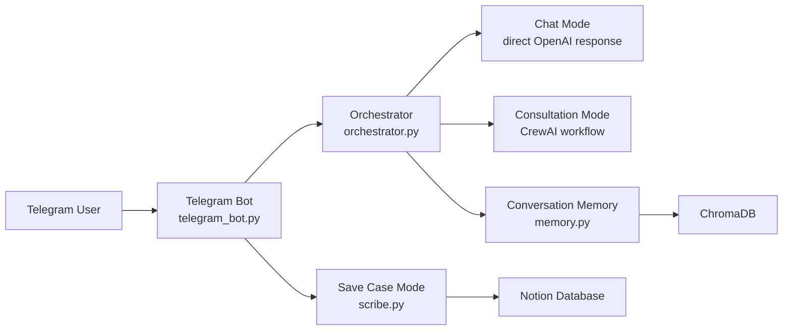
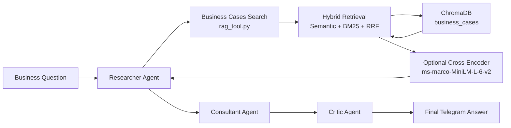
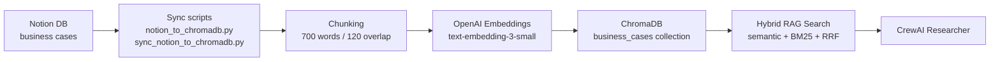

# AI Consulting Assistant

**RU summary:** Telegram AI-ассистент для бизнес-консультаций по внедрению AI. Проект объединяет multi-agent workflow на CrewAI, RAG-поиск по кейсам в ChromaDB, синхронизацию кейсов из Notion, память диалогов и обработку голосовых сообщений через Whisper.

## Overview

AI Consulting Assistant is a Telegram-based portfolio project that demonstrates how an LLM application can support business consulting workflows around AI adoption. The bot can answer regular chat questions, run a structured multi-agent consultation, search a local business-case knowledge base with RAG, save new cases to Notion, and keep lightweight conversation memory.

The project is intentionally MVP-sized, but it includes production-oriented building blocks: environment-based configuration, Docker support, CI, automated tests with mocks, local persistent ChromaDB storage, and clear documentation.

## Problem

Small teams exploring AI adoption often ask broad questions such as "How can we automate support?" or "Are there real examples of AI agents in sales?" A useful assistant should not only generate generic recommendations; it should ground answers in reusable cases, expose risks, and let the team grow its own knowledge base over time.

This project addresses that workflow with:

- a Telegram interface for quick access;
- business consultation mode with Researcher, Consultant, and Critic agents;
- RAG search over curated business cases;
- Notion as a lightweight case-management backend;
- local ChromaDB for embeddings and retrieval.

## Key Features

- **Telegram bot UX:** main menu, chat mode, business consultation mode, save-case flow, help/info screens.
- **Multi-agent consultation:** CrewAI Researcher, Consultant, and Critic agents collaborate on business AI questions.
- **Hybrid RAG knowledge base:** `ChromaRAGTool` retrieves AI business cases with OpenAI embeddings, BM25 lexical search, Reciprocal Rank Fusion, and optional cross-encoder reranking.
- **Notion case storage:** structured case creation through the Notion API.
- **Notion -> ChromaDB sync:** full rebuild and incremental sync scripts keep RAG data fresh.
- **Conversation memory:** previous user turns are stored and retrieved from ChromaDB.
- **Voice input:** Telegram voice messages are transcribed with Whisper before being routed to chat or consultation mode.
- **Photo analysis in chat mode:** image messages can be sent to the OpenAI vision-capable chat endpoint.
- **Tests and CI:** pytest suite with fakes/mocks, plus GitHub Actions.
- **Offline evals:** synthetic portfolio-safe RAG eval with baseline vs improved retrieval, precision@5, recall@5, and optional LLM-as-judge.
- **Dockerized runtime:** Dockerfile and Compose setup with a ChromaDB volume.

## Architecture





More details are available in [docs/architecture.md](docs/architecture.md).

## Multi-Agent Workflow

The consultation mode is designed as a three-step review loop:

1. **Researcher** searches the RAG knowledge base for relevant business cases, implementation patterns, tools, and outcomes.
2. **Consultant** turns the retrieved context into a practical recommendation with suggested architecture, expected results, and next steps.
3. **Critic** reviews the recommendation for missing evidence, implementation risks, hidden costs, data readiness, and compliance concerns.

This structure is intentionally more conservative than a single prompt because it separates retrieval, recommendation, and risk review.

## RAG Pipeline

Business cases are stored in Notion and synchronized into a local ChromaDB collection. Long records are split into 700-word chunks with 120-word overlap before indexing:



See [docs/rag_pipeline.md](docs/rag_pipeline.md) for implementation notes.

## Notion Integration

The bot can save a new business case from Telegram into Notion using `scribe.py`. A case includes title, category, use case, tools, summary, implementation details, pros, cons, source, and date.

Notion synchronization is handled by:

- `notion_to_chromadb.py` for a full rebuild of the `business_cases` ChromaDB collection;
- `sync_notion_to_chromadb.py` for incremental sync based on Notion `last_edited_time`.

The Notion database id is configured through `NOTION_DATABASE_ID` and is not committed to the repository.

## Voice Input via Whisper

Telegram voice messages are downloaded as audio files, transcribed with Whisper, and then routed through the selected mode:

- chat mode sends the transcript to direct chat;
- consultation mode sends it to the multi-agent workflow;
- auto mode chooses based on keywords.

The voice path is kept inside `telegram_bot.py`, while pure helper logic is tested separately.

## Tech Stack

- Python 3.11
- python-telegram-bot
- OpenAI API: chat, embeddings, Whisper transcription
- CrewAI
- ChromaDB
- rank_bm25 for lexical retrieval
- structlog for structured application logs
- optional sentence-transformers cross-encoder reranking
- Notion API
- pytest and pytest-asyncio
- Docker and Docker Compose
- GitHub Actions CI

## Setup

Clone the repository and create a virtual environment:

```bash
git clone https://github.com/grinegor/consulting-assistant.git
cd consulting-assistant
python -m venv .venv
source .venv/bin/activate
pip install -r requirements.txt
pip install -r requirements-dev.txt
```

Create local environment variables:

```bash
cp .env.example .env
```

Fill in `.env`:

```env
OPENAI_API_KEY=your_openai_api_key
TELEGRAMBOT_API_KEY=your_telegram_bot_token
NOTION_API_KEY=your_notion_integration_secret
NOTION_DATABASE_ID=your_notion_database_id
CHROMA_PATH=./chroma_db
BUSINESS_CASES_COLLECTION=business_cases
MEMORY_COLLECTION=conversation_memory
LOG_LEVEL=INFO
RAG_ENABLE_RERANKING=false
```

Run the bot:

```bash
python telegram_bot.py
```

Sync Notion cases into ChromaDB:

```bash
python sync_notion_to_chromadb.py
```

For a full rebuild:

```bash
python notion_to_chromadb.py
```

## Docker Setup

Build and run the Telegram bot service:

```bash
docker compose up --build
```

The Compose setup:

- reads secrets and ids from `.env`;
- mounts `./chroma_db` into the container for local ChromaDB persistence;
- includes a local process healthcheck that does not call Telegram, OpenAI, or Notion;
- runs `python telegram_bot.py`.

Stop the service:

```bash
docker compose down
```

## Tests

Run the full test suite:

```bash
pytest
```

Run the compact CI-style command:

```bash
python -m pytest -q
```

Run eval and stress subsets:

```bash
.venv/bin/python -m pytest -q -m eval
.venv/bin/python -m pytest -q -m stress
```

Compile-check project files:

```bash
python -m compileall -q telegram_bot.py scribe.py agents.py digest.py main.py memory.py notion_to_chromadb.py orchestrator.py rag_tool.py sync_notion_to_chromadb.py tests
```

Tests use mocks/fakes instead of real Telegram, OpenAI, Notion, CrewAI, or ChromaDB calls.

## Offline RAG Evals

Run the deterministic portfolio-safe eval:

```bash
.venv/bin/python -m evals.portfolio_rag_eval --skip-llm
```

This writes `evals/latest_local_result.json` and prints a compact summary. The dataset contains 25 synthetic business questions and 12 synthetic case documents, so it is safe to publish and fast enough for local CI-style checks. Metrics are computed over the top five retrieved documents:

- `precision@5`: fraction of the five retrieved documents that match the expected ids.
- `recall@5`: fraction of expected ids that appear in the top five.

Optional LLM-as-judge:

```bash
.venv/bin/python -m evals.portfolio_rag_eval
```

The judge only calls OpenAI when `OPENAI_API_KEY` is set. If the key is missing, the judge is reported as skipped; deterministic precision/recall still run.

Optional reranking can be enabled locally:

```bash
pip install -r requirements-rerank.txt
RAG_ENABLE_RERANKING=true python telegram_bot.py
```

Latest local result:

- Command: `.venv/bin/python -m evals.portfolio_rag_eval --skip-llm`
- Dataset: `synthetic_portfolio_rag_v1`, 25 questions, 12 documents.
- Baseline retrieval: `precision@5 = 0.192`, `recall@5 = 0.92`.
- Improved retrieval: `precision@5 = 0.208`, `recall@5 = 1.0`.
- Improvement: `+0.016 precision@5`, `+0.08 recall@5`.
- LLM judge: skipped, reason `disabled by --skip-llm`.
- Report: `evals/latest_local_result.json`.

## Roadmap

- Add a web dashboard for reviewing synced cases and retrieval quality.
- Add scheduled Notion synchronization.
- Add structured observability for agent runs and retrieval traces.
- Add richer eval datasets for consultation quality and risk coverage.
- Add deployment manifests for a small cloud VM or container platform.

## Known Limitations

- MVP-grade local deployment, not a production SaaS backend.
- ChromaDB is local by default and should be backed up or replaced for production.
- No enterprise auth, RBAC, tenant isolation, or audit log yet.
- No production monitoring, alerting, or tracing yet.
- Telegram markdown output may require extra escaping for arbitrary model output.
- Notion schema expectations are currently encoded in the sync scripts.

More detail is documented in [docs/limitations.md](docs/limitations.md).
