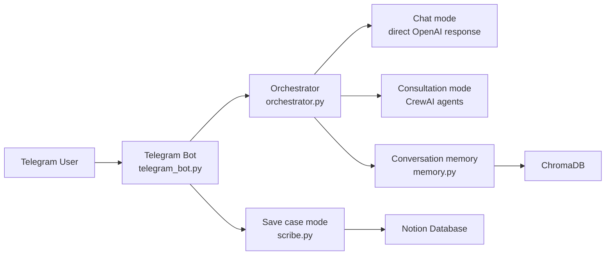
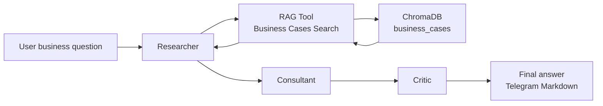
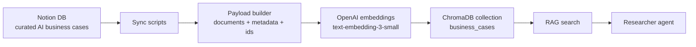

# Architecture

This project is organized around a Telegram interface, an orchestration layer, a multi-agent consultation workflow, and a local RAG knowledge base backed by ChromaDB.

## Runtime Flow

## Consultation Mode

The Researcher is responsible for grounding recommendations in retrieved cases. The Consultant translates context into practical implementation advice. The Critic highlights weak evidence, hidden costs, compliance concerns, and implementation risks.

## Data Pipeline

## Key Modules

- `telegram_bot.py` handles Telegram commands, menus, text messages, voice messages, image messages, and save-case interactions.
- `orchestrator.py` routes messages between chat mode, consultation mode, and auto mode.
- `rag_tool.py` wraps ChromaDB search as a CrewAI tool.
- `memory.py` stores and retrieves conversation memory from ChromaDB.
- `scribe.py` creates structured Notion pages for new business cases.
- `notion_to_chromadb.py` performs a full rebuild from Notion into ChromaDB.
- `sync_notion_to_chromadb.py` performs incremental Notion synchronization.

## Configuration Boundary

Secrets and private IDs are loaded from environment variables. The repository includes `.env.example` but does not commit real `.env` values, Notion database IDs, tokens, or ChromaDB data.
