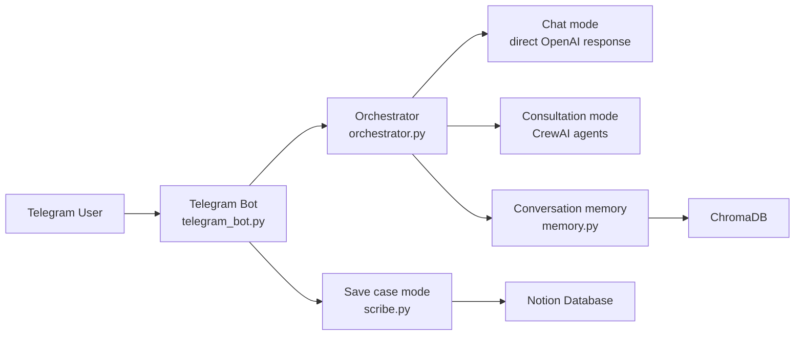
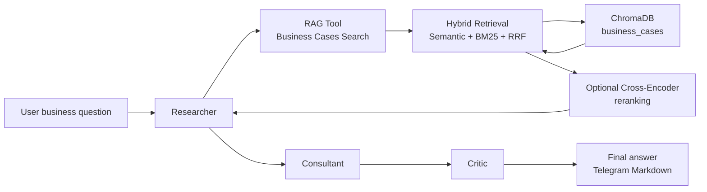
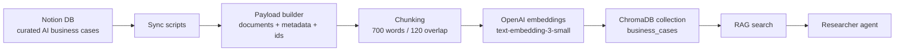
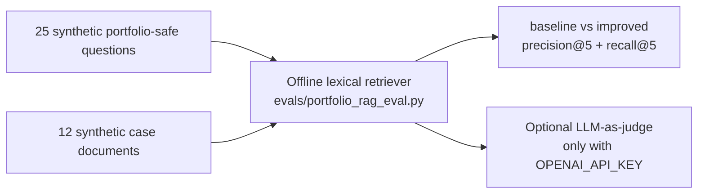

# Architecture

This project is organized around a Telegram interface, an orchestration layer, a multi-agent consultation workflow, and a local RAG knowledge base backed by ChromaDB.

## Runtime Flow

## Consultation Mode

The Researcher is responsible for grounding recommendations in retrieved cases. The Consultant translates context into practical implementation advice. The Critic highlights weak evidence, hidden costs, compliance concerns, and implementation risks.

## Data Pipeline

## Evaluation Boundary

The eval pipeline is intentionally separate from the live ChromaDB/OpenAI RAG path. It gives the repository a fast, deterministic retrieval-quality check without requiring model downloads, real Notion data, ChromaDB services, or OpenAI credentials in CI. The latest local deterministic run compares a title/category baseline against an improved full-text retrieval pass. The optional LLM judge is a qualitative overlay and is skipped when `OPENAI_API_KEY` is absent.

## Key Modules

- `telegram_bot.py` handles Telegram commands, menus, text messages, voice messages, image messages, and save-case interactions.
- `orchestrator.py` routes messages between chat mode, consultation mode, and auto mode.
- `rag_tool.py` wraps hybrid ChromaDB/BM25/RRF retrieval as a CrewAI tool and can optionally apply cross-encoder reranking.
- `evals/portfolio_rag_eval.py` runs the offline synthetic RAG eval and writes the latest local JSON report.
- `memory.py` stores and retrieves conversation memory from ChromaDB.
- `scribe.py` creates structured Notion pages for new business cases.
- `notion_to_chromadb.py` performs a full rebuild from Notion into ChromaDB.
- `sync_notion_to_chromadb.py` performs incremental Notion synchronization.

## Configuration Boundary

Secrets and private IDs are loaded from environment variables. The repository includes `.env.example` but does not commit real `.env` values, Notion database IDs, tokens, or ChromaDB data.
